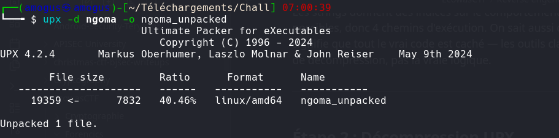
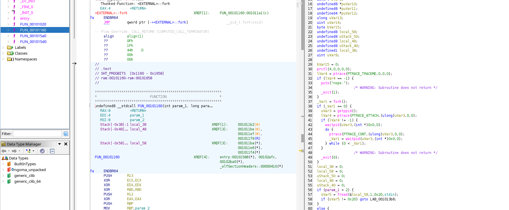
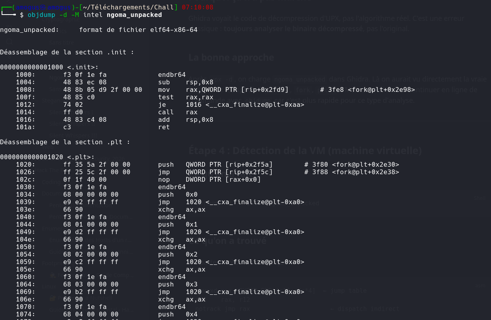
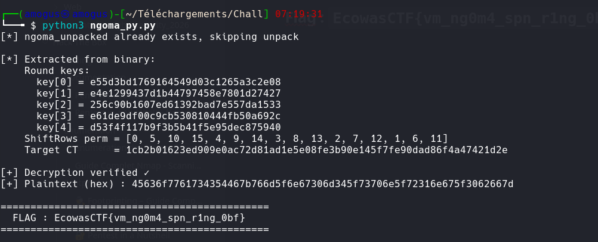

# Ngoma

**Catégorie :** Reverse Engineering  
**Flag :** `EcowasCTF{vm_ng0m4_spn_r1ng_0bf}`

## Description

> A small drum, at times it hits but not like cerberus or maybe medusa or maybe joyboy?

## Writeup

### Étape 1 — Reconnaissance initiale

```bash
strings ngoma
file ngoma
```

Résultat :
```
UPX!  ← binaire compressé
nope.
the drum answers: correct.
silence.
the drum breaks.
```

Le binaire est **UPX-packed**. Les outils classiques voient le stub de décompression, pas la vraie logique.

### Étape 2 — Décompression UPX

```bash
upx -d ngoma -o ngoma_unpacked
```



### Étape 3 — Analyse statique avec Ghidra

On charge `ngoma_unpacked` dans Ghidra (pas l'original). On trouve la vraie `main` avec des appels à `ptrace`, `fork`, `prctl`.



### Étape 4 — Détection de la VM

```bash
objdump -d -M intel ngoma_unpacked
```



Pattern caractéristique d'un **interpréteur de bytecode** :

```asm
movsxd rax, DWORD PTR [r12+rdx*4]  ← jump table
add    rax, r12
notrack jmp rax                      ← dispatch indirect
```

### Étape 5 — Reverse de l'encodage du bytecode

```
opcode = ((PC × 0x5B) XOR raw_byte XOR 0xA3) & 0xF
```

### Étape 6 — Identification de l'algorithme (AES)

- `mem[0x100:0x200]` = **S-box AES exacte** (256 valeurs de Rijndael)
- `mem[0x70:0x80]` = **ShiftRows AES exacte**
- Opérations GF(2⁸) avec polynôme `0x11b` = **MixColumns AES**

### Étape 7 — Structure de chiffrement

```
Encrypt(block) =
    AddRoundKey(key[0])
    → pour i de 1 à 4 :
        SubBytes+ShiftRows → MixColumns → AddRoundKey(key[i])
```

### Étape 8 — Script de déchiffrement

<details>
<summary>Voir le script Python complet</summary>

```python
#!/usr/bin/env python3
"""
Solver for ngoma — 4-round AES-like SPN
"""
import struct, subprocess, os, sys

BINARY   = "ngoma"
UNPACKED = "ngoma_unpacked"

if not os.path.exists(UNPACKED):
    subprocess.run(["upx", "-d", BINARY, "-o", UNPACKED], check=True)

with open(UNPACKED, "rb") as f:
    binary = f.read()

RODATA_FILE_OFFSET = 0x2000
VM_DATA_OFFSET     = RODATA_FILE_OFFSET + 0xa0
vm_mem = bytearray(binary[VM_DATA_OFFSET : VM_DATA_OFFSET + 0x800])

keys   = [bytes(vm_mem[0x20 + i*16 : 0x20 + i*16 + 16]) for i in range(5)]
PERM   = list(vm_mem[0x70:0x80])
SBOX   = list(vm_mem[0x100:0x200])
target = bytes(vm_mem[0x200:0x220])

INV_SBOX = [0] * 256
for i, s in enumerate(SBOX): INV_SBOX[s] = i
INV_PERM = [0] * 16
for i, p in enumerate(PERM): INV_PERM[p] = i

def gf_mul(a, b):
    a, b, result = a & 0xff, b & 0xff, 0
    for _ in range(8):
        if b & 1: result ^= a
        msb = a & 0x80
        a = (a << 1) & 0xff
        if msb: a ^= 0x1b
        b >>= 1
    return result

def add_round_key(s, k): return bytes(x ^ y for x, y in zip(s, k))
def sub_shift(s):
    sb = [SBOX[b] for b in s]
    return bytes(sb[PERM[i]] for i in range(16))
def mix_columns(s):
    r = []
    for c in range(4):
        a = s[c*4:c*4+4]
        r += [gf_mul(2,a[0])^gf_mul(3,a[1])^a[2]^a[3],
              a[0]^gf_mul(2,a[1])^gf_mul(3,a[2])^a[3],
              a[0]^a[1]^gf_mul(2,a[2])^gf_mul(3,a[3]),
              gf_mul(3,a[0])^a[1]^a[2]^gf_mul(2,a[3])]
    return bytes(r)
def inv_sub_shift(s):
    u = bytes(s[INV_PERM[i]] for i in range(16))
    return bytes(INV_SBOX[b] for b in u)
def inv_mix_columns(s):
    r = []
    for c in range(4):
        a = s[c*4:c*4+4]
        r += [gf_mul(14,a[0])^gf_mul(11,a[1])^gf_mul(13,a[2])^gf_mul(9,a[3]),
              gf_mul(9,a[0])^gf_mul(14,a[1])^gf_mul(11,a[2])^gf_mul(13,a[3]),
              gf_mul(13,a[0])^gf_mul(9,a[1])^gf_mul(14,a[2])^gf_mul(11,a[3]),
              gf_mul(11,a[0])^gf_mul(13,a[1])^gf_mul(9,a[2])^gf_mul(14,a[3])]
    return bytes(r)

def decrypt_block(ct, keys):
    s = ct
    for i in range(4, 0, -1):
        s = add_round_key(s, keys[i])
        s = inv_mix_columns(s)
        s = inv_sub_shift(s)
    return add_round_key(s, keys[0])

pt1 = decrypt_block(target[:16], keys)
pt2 = decrypt_block(target[16:], keys)
print((pt1 + pt2).decode())
```
</details>

### Résultat



## Flag

```
EcowasCTF{vm_ng0m4_spn_r1ng_0bf}
```

> Le flag résume tout : **vm** (machine virtuelle), **ng0m4** (ngoma), **spn** (Substitution-Permutation Network), **r1ng** (GF(2⁸)), **0bf** (obfuscation).
