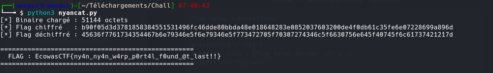

# Nyankonton

**Catégorie :** Reverse Engineering  
**Architecture :** Mach-O ARM64  
**Flag :** `EcowasCTF{ny4n_ny4n_w4rp_p0rt4l_f0und_@t_last!!}`

## Description

> The portal closes in 24 moves, you need to put your skills to work and get into the portal before it closes.

## Writeup

### Étape 1 — Reconnaissance

```bash
file nyancat
strings nyancat
```

```
Mach-O 64-bit arm64 executable
W/S = up/down, Q = quit
NYANKONTON — JOJO's PORTAL
Nyancat soars into the void. The portal stays closed.
X8EQS  _NK_FLAG_CT
```

Le flag est **chiffré** — `strings` ne montre rien d'utile.

### Étape 2 — Parsing Mach-O

```python
# Sections identifiées
# __text   : 0x3628 → code ARM64
# __const  : 0x3f68 → flag chiffré (48 octets)
# __bss    : 0x8010 → buffer de sortie
```

### Étape 3 — Scan MOVZ/MOVK (ARM64)

En ARM64, une constante 64 bits nécessite 4 instructions :

```asm
MOVZ X19, #0x6cfc
MOVK X19, #0xa46a, LSL #16
MOVK X19, #0x0bb2, LSL #32
MOVK X19, #0x0c5b, LSL #48
; → X19 = 0x0c5b0bb2a46a6cfc  (clé initiale)
```

La constante `0x9e3779b97f4a7c15` = `2^64 / φ` (Fibonacci hashing).

### Étape 4 — Algorithme reconstitué

```
Clé initiale  : K0 = 0x0c5b0bb2a46a6cfc
Multiplicateur: M  = 0x9e3779b97f4a7c15

Pour chaque bloc de 8 octets (6 blocs = 48 octets) :
    1. XOR chaque octet chiffré avec l'octet de clé correspondant
    2. K = ROR(K, 57) × M  (mod 2^64)
```

### Étape 5 — Script de déchiffrement

```python
#!/usr/bin/env python3
import struct

with open("nyancat", "rb") as f:
    data = f.read()

KEY_INIT   = 0x0c5b0bb2a46a6cfc
MULTIPLIER = 0x9e3779b97f4a7c15
encrypted  = data[0x3f68 : 0x3f68 + 48]

def ror64(val, shift):
    return ((val >> shift) | (val << (64 - shift))) & 0xFFFFFFFFFFFFFFFF

key, flag = KEY_INIT, []
for block in range(6):
    key_bytes = [(key >> (j * 8)) & 0xFF for j in range(8)]
    for j in range(8):
        flag.append(encrypted[block * 8 + j] ^ key_bytes[j])
    key = (ror64(key, 57) * MULTIPLIER) & 0xFFFFFFFFFFFFFFFF

print(bytes(flag).decode())
```

### Résultat



## Flag

```
EcowasCTF{ny4n_ny4n_w4rp_p0rt4l_f0und_@t_last!!}
```
