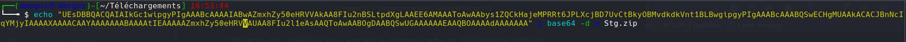
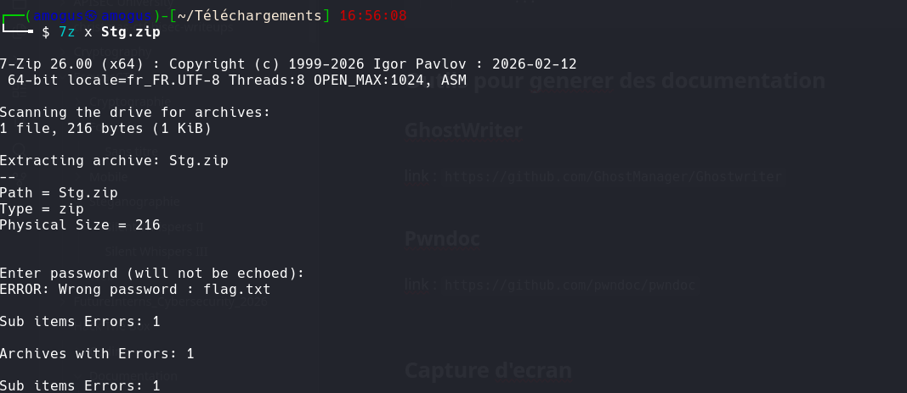
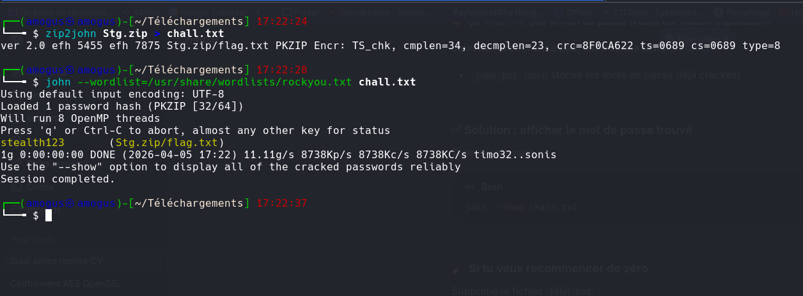
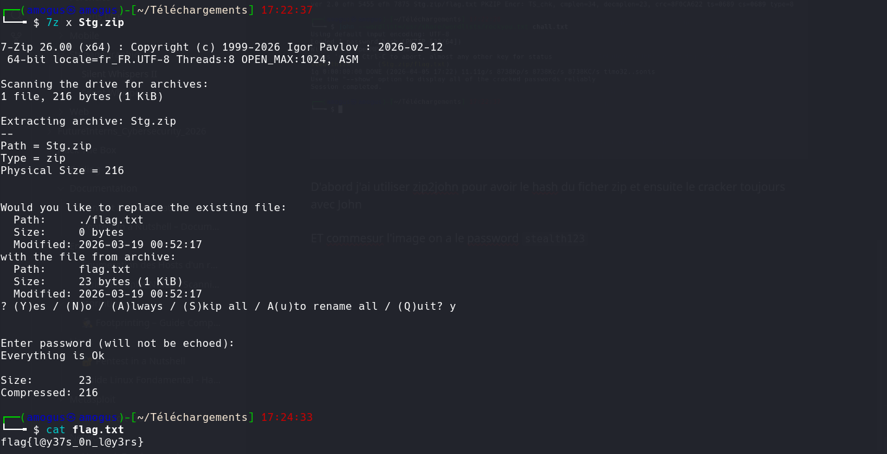

# Silent Whispers II

**Catégorie :** Steganographie  
**Flag :** `flag{l@y37s_0n_l@y3rs}`

## Description

> We intercepted another message… and this time, it feels intentional. At first glance, everything looks normal. But given past incidents, we suspect something is hidden beneath the surface. This may not be a simple extraction. Be prepared to dig deeper.

Fichier fourni : `information_II.txt`

## Writeup

### Étape 1 — Extraction avec stegsnow

```bash
stegsnow -C information_II.txt
```

On obtient une longue chaîne base64.

### Étape 2 — Décodage du ZIP en base64

```bash
echo "UEsDBBQACQAIAIkGc1wipgyP..." | base64 -d > Stg.zip
```



### Étape 3 — Extraction du ZIP protégé par mot de passe



Le ZIP est protégé par un mot de passe. On utilise `john` pour le cracker :

```bash
zip2john Stg.zip > hash.txt
john hash.txt --wordlist=/usr/share/wordlists/rockyou.txt
```



Mot de passe trouvé : `stealth123`

### Étape 4 — Lecture du flag



## Flag

```
flag{l@y37s_0n_l@y3rs}
```
