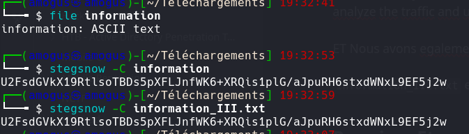
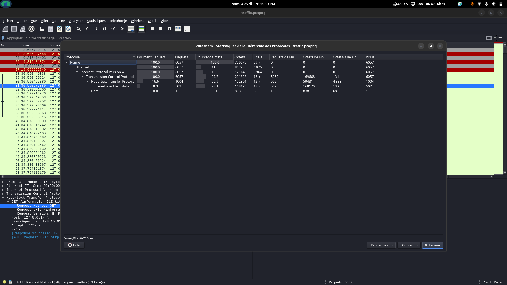
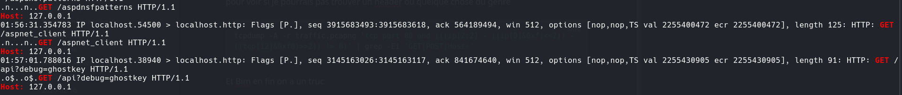
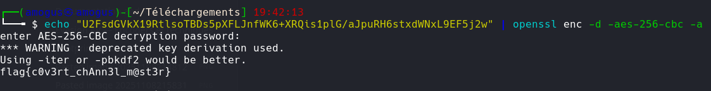

# Silent Whispers III

**Catégorie :** Steganographie  
**Flag :** `flag{c0v3rt_chAnn3l_m@st3r}`

## Description

> A suspected insider has been exfiltrating sensitive data through normal-looking communications. Network traffic was captured, but nothing immediately stands out. However, analysts believe the attacker may have left subtle traces behind. Your task is to analyze the traffic and uncover any hidden data. Every detail matters.

Fichiers fournis : `information_III.txt` et `traffic.pcapng`

## Writeup

### Étape 1 — Extraction avec stegsnow

```bash
stegsnow -C information_III.txt
```

On obtient :

```
U2FsdGVkX19RtlsoTBDs5pXFLJnfWK6+XRQis1plG/aJpuRH6stxdWNxL9EF5j2w
```



Après recherche, on identifie du **AES-256 (OpenSSL)**. La commande de déchiffrement nécessite un mot de passe :

```bash
echo "U2FsdGVkX19RtlsoTBDs5pXFLJnfWK6+XRQis1plG/aJpuRH6stxdWNxL9EF5j2w" | openssl enc -d -aes-256-cbc -a
```

### Étape 2 — Analyse du PCAP

On ouvre `traffic.pcapng` dans Wireshark. La hiérarchie des protocoles montre le protocole `Data`.



On utilise `tcpdump` pour chercher des headers HTTP :

```bash
tcpdump -A -r traffic.pcapng 'tcp port 80 and (((ip[2:2] - ((ip[0]&0xf)<<2)) - ((tcp[12]&0xf0)>>2)) != 0)' | grep -Ei 'GET|POST|Host:'
```



On trouve un nom qui ressemble à un mot de passe.

### Étape 3 — Déchiffrement AES

On utilise le mot de passe trouvé dans le PCAP :



## Flag

```
flag{c0v3rt_chAnn3l_m@st3r}
```
