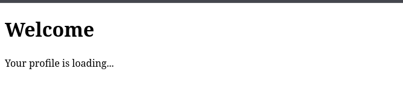
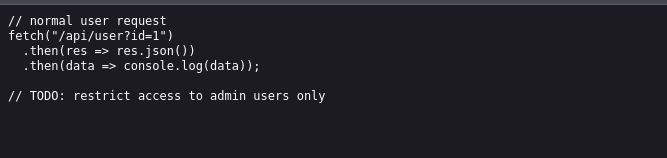
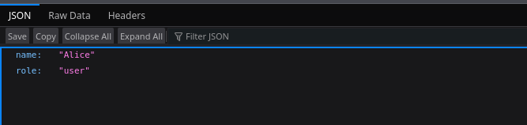
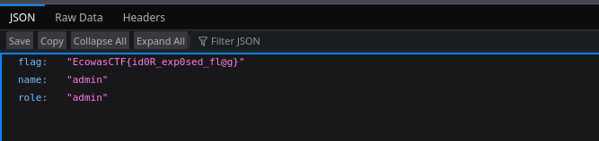

# Broken Trust

**Catégorie :** Web  
**Flag :** `EcowasCTF{id0R_exp0sed_fl@g}`

## Description

> The authentication system here seems secure at first glance… but sometimes, trust is misplaced. Your goal is to exploit how the server validates users and discover the hidden flag.

## Writeup

### Présentation du site



Avec un `Ctrl + U` on accède au code source de la page.



On remarque un endpoint intéressant : `/api/user?id=1`

```
http://labs.ecowasctf.com.gh:5555//api/user?id=1
```



### Exploitation — IDOR

La présence du `1` dans l'URL rappelle une vulnérabilité très connue : **IDOR (Insecure Direct Object Reference)**.

On tente de remplacer le `1` par `0` :

```
http://labs.ecowasctf.com.gh:5555//api/user?id=0
```

**Bingo !**



## Flag

```
EcowasCTF{id0R_exp0sed_fl@g}
```
