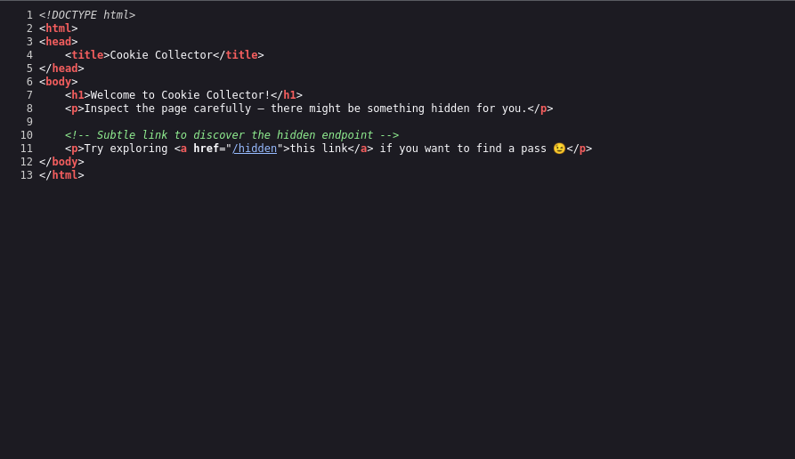
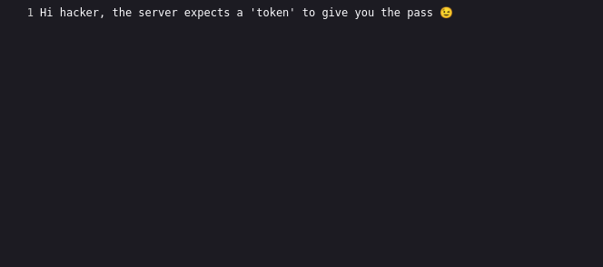
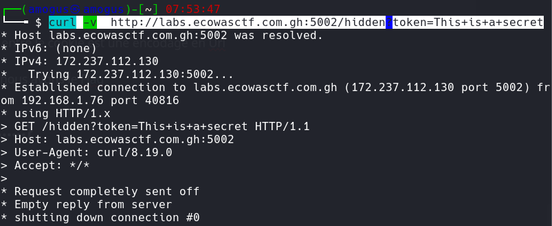
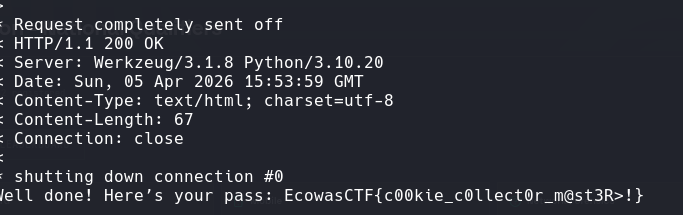

# Cookie Collector

**Catégorie :** Web  
**Flag :** `EcowasCTF{c00kie_c0llect0r_m@st3R>!}`

## Description

> The server likes cookies...but not the kind you eat. Somewhere hidden on the page is a special endpoint, and it's waiting for the correct "token" to give you a pass. Can you find it?

**URL :** `http://labs.ecowasctf.com.gh:5002/`

## Writeup

### Présentation du site



Dans le code source, on remarque la présence d'un répertoire `/hidden`.



La page nous dit que le serveur a besoin d'un token. La description mentionne les cookies — on inspecte avec `F12`.

Le cookie est encodé en **hexadécimal**. En le décodant avec CyberChef on obtient :

```
This is a secret
```

### Exploitation

On essaie d'abord via curl avec un header :

```bash
curl -H "Cookie: token=This is a secret" http://labs.ecowasctf.com.gh:5002/hidden
```

Ça ne fonctionne pas. On tente d'envoyer le token directement dans l'URL (requête GET) avec encodage URL :

```bash
curl -v http://labs.ecowasctf.com.gh:5002/hidden?token=This+is+a+secret
```

**Bingo !**





## Flag

```
EcowasCTF{c00kie_c0llect0r_m@st3R>!}
```
