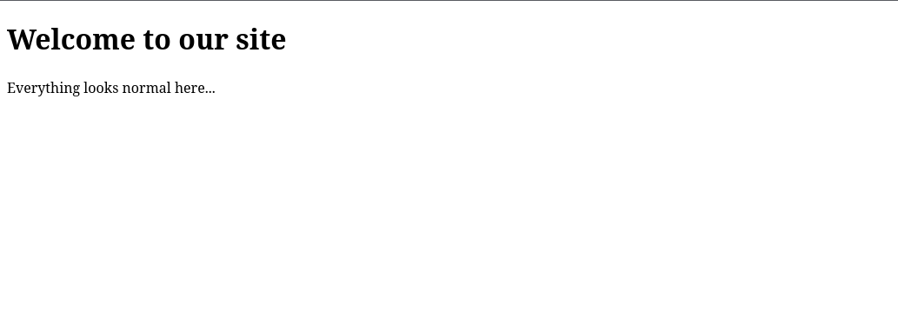
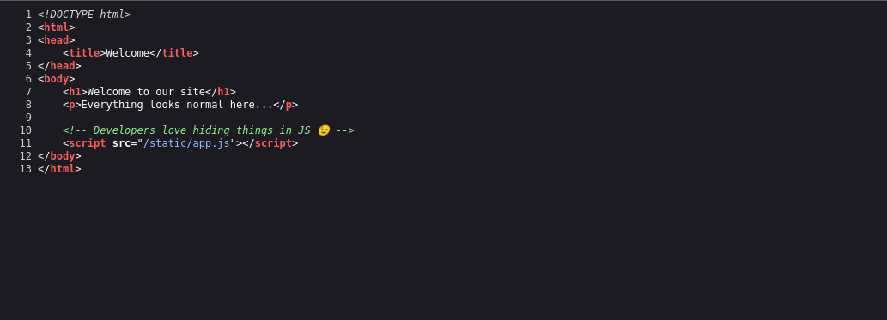
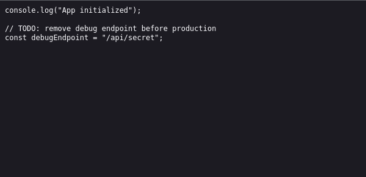
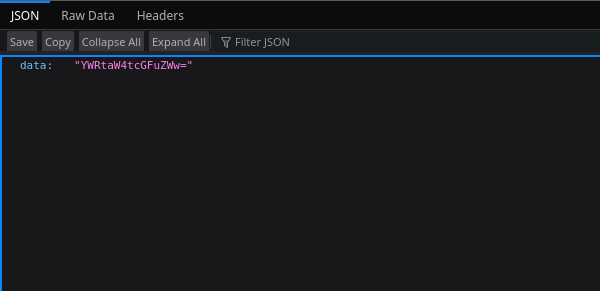
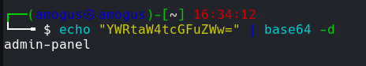
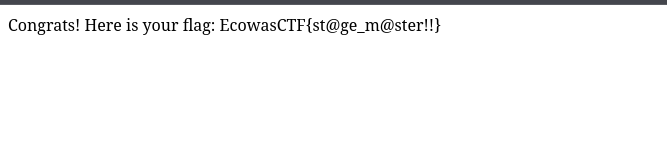

# Hidden Layers

**Catégorie :** Web  
**Flag :** `EcowasCTF{st@ge_m@ster!!}`

## Description

> Something strange is going on with the user management system. It looks like some accounts are hidden, and you might be able to see more than you should. Your goal is to discover the "special" account that holds the secret flag.

## Writeup

### Présentation du site



Avec `Ctrl + U` on accède au code source.



On voit la présence d'un fichier JS non visible sur la page.



Dans ce fichier JS, on trouve un endpoint intéressant : `/api/secret`

```
http://labs.ecowasctf.com.gh:5000/api/secret
```



On trouve un encodage en **base64** : `YWRtaW4tcGFuZWw=`

On décode :

```bash
echo "YWRtaW4tcGFuZWw=" | base64 -d
# admin-panel
```



On remplace dans l'URL :

```
http://labs.ecowasctf.com.gh:5000/admin-panel
```



## Flag

```
EcowasCTF{st@ge_m@ster!!}
```
